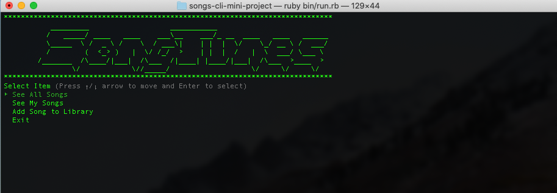

# Song Tunes

Ruby Version => '2.6.1'
Database => PostgreSQL '1.2.3'

## Summary 

This is CLI project that allows users to check out check out a vast discography of songs from many different artists!

User Stories: 
  - I can view all the songs (User)
  - I can see all the songs in my library (User)
  - I can search for songs in my library by artist (User)
  - I can search for songs in my library by title (User)
  - I can add a song to my library (User)
  - I can find the most popular song in my library (User)
  - I can find the most popular song amongst all users (SongUser)

## Instructions

1. Clone down this repo and cd into the directory

2. Run bundle install

3. Run rake db:setup

4. Run rake db:migrate

5. Run rake db:seed

6. Run ruby bin/run.rb

## RSpec Tests 

1. There are tests for models in the lib folder written in Rpec

2. Make sure models are running successfully by running rspec